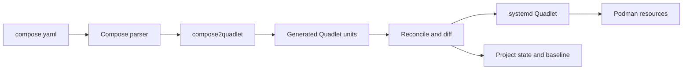

# Architecture

comquad turns a Compose project into systemd-managed Podman services. It does not supervise containers itself. It generates Quadlet files, asks systemd to reload them, and uses systemd and Podman for the runtime operations.

## System Overview



The main path is:

1. Read and validate `compose.yaml`.
2. Convert Compose objects into Quadlet units.
3. Compare the generated units with the deployed project.
4. Show a diff and ask for confirmation when changes are found.
5. Write the units, reload systemd, and start or restart affected resources.
6. Record the deployment state and generated baseline.

## Repository Structure

```text
cmd/comquad/           CLI commands and entry point
compose2quadlet/       Compose-to-Quadlet conversion library
internal/orchestrator/ Deployment pipeline and command behavior
internal/reconcile/    Diffing, merging, and atomic application
internal/deploy/       systemd D-Bus, Podman, paths, and project state
internal/logger/       Output levels and color handling
tests/integration/     End-to-end tests using Podman and systemd
```

The orchestrator coordinates the other packages. The conversion library produces units; the reconcile package decides what should change; the deploy package applies those changes through systemd and Podman.

## `up` Lifecycle

`comquad up` is the primary operation. Its pipeline has four stages:

### 1. Read and Transpile

`compose2quadlet.TranspileFile()` loads the Compose file through compose-go/v2 and produces structured Quadlet units. It handles services, networks, volumes, secrets, images, and build blocks, then serializes them as Quadlet INI files.

The conversion also applies comquad-specific behavior, including:

- Project-prefixed resource names and references
- Container names and service network aliases
- A default network when a service has no explicit network
- Absolute paths for relative bind mounts
- SELinux mount relabeling when applicable
- Rootless port offsets
- Image and build unit generation
- comquad management and project labels

The conversion library is documented separately in [compose2quadlet/ARCHITECTURE.md](./compose2quadlet/ARCHITECTURE.md) and [compose2quadlet/doc/mapping.md](./compose2quadlet/doc/mapping.md).

### 2. Compute a Change Plan

`internal/reconcile` compares the new generated units with the files currently deployed. The result is a read-only plan containing per-file changes, removals, and merge conflicts.

On an existing deployment, comquad uses three inputs:

- **Baseline:** the units generated by the previous successful `up`
- **Disk:** the files currently in the systemd Quadlet directory
- **New:** the units generated from the current `compose.yaml`

This allows comquad to distinguish Compose changes from manual edits made with `comquad edit`:

```text
baseline + manual edits + new Compose output
                  |
                  v
             merged units
```

Conflicting edits are reported and the manual value wins. On a first deployment, or after `regenerate`, no baseline is available, so comquad falls back to a two-way comparison and warns that manual changes cannot be identified.

### 3. Show and Apply Changes

Unless `--no-diff` is used, `up` displays the plan before applying it. New files are shown in full, changed files as unified diffs, and removed files as removal diffs.

`--dry-run` computes and displays the plan without writing files, updating state, pulling images, reloading systemd, or starting units.

Applying a plan:

1. Writes generated Quadlet files atomically.
2. Removes files for services no longer in the Compose file.
3. Updates the baseline.
4. Reloads the systemd manager.
5. Starts new resources and restarts changed containers and images.
6. Registers the project in the state file.

Only affected units are restarted. If a later step fails, files and baselines touched by the deployment are restored where possible.

### 4. Follow Logs

`comquad up -f` performs the deployment first, then follows journal output for the project units. The log start time is captured before units are started so startup logs are included.

## Reconciliation and State

comquad keeps two kinds of local state:

- `projects.json` records deployed projects, source paths, generated files, and managed resources.
- `baseline/<project>/` stores the pure generated output from the last successful deployment.

The baseline is deliberately separate from the files on disk. This is what makes it possible to preserve manual changes while still applying changes from `compose.yaml`.

State is stored below `$XDG_DATA_HOME/comquad/`, defaulting to `~/.local/share/comquad/`. The state file is written through a temporary file and rename so an interrupted write does not leave a partial JSON file.

`comquad regenerate --force` rebuilds project state from managed Podman labels and Quadlet files. Because it cannot reconstruct the previous generated baseline, the next `up` uses the two-way comparison described above.

## Generated Resources

Depending on the Compose file, comquad can generate:

| Compose resource | Quadlet resource |
|---|---|
| Service | `.container` |
| Image reference | `.image` |
| Build block | `.build` |
| Network | `.network` |
| Named volume | `.volume` |
| Secret | Native secret directives or secret mounts |

Container units reference their companion image or build units. This lets Quadlet and systemd express dependencies between pulling or building an image and starting its container.

External networks and volumes are not generated or removed by comquad. They remain references to the externally managed Podman resources.

Generated files are placed in the systemd Quadlet directory for the current execution context:

- Rootless: `~/.config/containers/systemd`
- Root: `/etc/containers/systemd`

## Runtime Commands

Commands such as `start`, `stop`, and `restart` operate on already-generated units through systemd D-Bus. They do not regenerate files or run reconciliation.

Commands that inspect or interact with services use the project state to resolve Compose service names to Quadlet files:

- `ps` combines Podman container information with systemd unit state.
- `logs` reads journald output and combines logs from multiple units chronologically.
- `exec` runs `podman exec` against the resolved container.
- `view` reads generated units and can show a project resource overview.
- `edit` opens generated units in `$EDITOR`, then reloads systemd when files change.

`down` stops the project's units, removes generated files and managed networks, unregisters the project, and removes auxiliary state. Named volumes are retained unless `--delete-volumes` is supplied.

## Failure Boundaries

comquad treats generated files, state, and systemd operations as separate steps:

- Transpilation errors stop before deployment.
- Dry runs do not perform writes or runtime changes.
- Reconciliation plans are computed before files are modified.
- File and baseline writes are atomic and have rollback handling.
- A failed service operation is reported rather than hidden by the CLI.

The systemd manager remains the source of truth for whether a unit is running. Podman remains the source of truth for container and resource details.

## Further Reading

- [README.md](./README.md) for installation and command usage
- [DEVELOPMENT.md](./DEVELOPMENT.md) for package details, command internals, and testing
- [compose2quadlet/ARCHITECTURE.md](./compose2quadlet/ARCHITECTURE.md) for the conversion library
- [compose2quadlet/doc/mapping.md](./compose2quadlet/doc/mapping.md) for Compose field mappings
